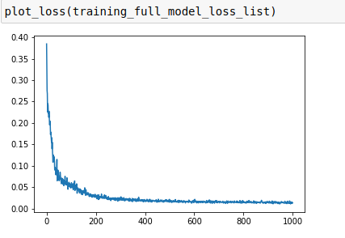
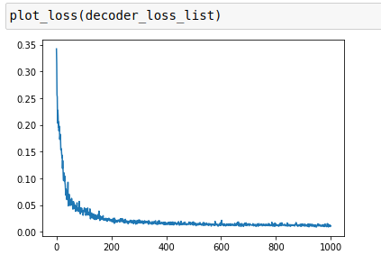
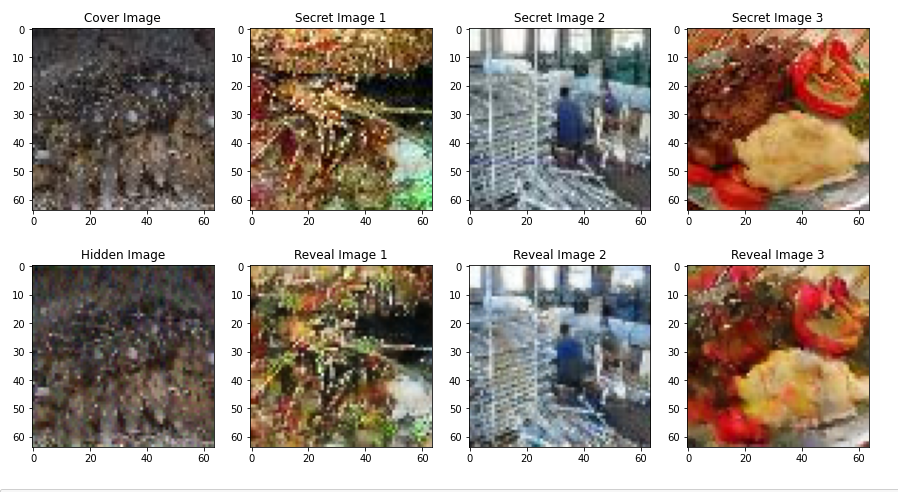

# MultiImageSteganography

### Multi-Image Steganography: Hiding Three Secret Images Inside One Cover Image
Project Overview
The Multi-Image Steganography project implements an advanced method of hiding three secret images within a single cover image using deep learning techniques. Traditional steganography methods often fall short in terms of embedding capacity, especially when multiple secret images are involved, without compromising the quality of the cover image. This project leverages Convolutional Neural Networks (CNNs) to efficiently hide multiple images while maintaining the visual integrity of the cover image, ensuring that the secret images remain hidden and can be accurately extracted.

This deep learning-based approach extends the potential of steganography by using a neural network to optimize both embedding and extraction processes, offering a scalable, robust, and secure method for multi-image hiding. The project has been built and trained from scratch using the ImageNet dataset.

# Key Features
1. Multiple Secret Image Embedding: Unlike traditional methods that embed only one secret image, this project can hide three different images inside a single cover image.

2. Convolutional Neural Network (CNN): Uses a custom encoder-decoder CNN architecture that optimizes the steganography process.

3. Custom Loss Function: Combines Mean Squared Error (MSE), Structural Similarity Index (SSIM), and Total Variation Loss to maintain the quality of the hidden and recovered images.
    <li>
    
    1. Full Model Loss:
        
        - Lossfull​= α⋅MSEembed ​+ β⋅MSEextract ​+ other_loss_components        
        

    2. Decoder Loss :
        A Decoder Loss is used to measure the performance of the decoder, focused solely on the extraction process:
        - Lossdecoder = MSEextract
        

        where,
        1. MSEembed: This measures the error in embedding the secret images into the cover image. A lower MSEembed means the secret images are hidden within the cover image with minimal distortion. 
        2. MSEextract: This measures the error in extracting the secret images from the hidden image. A lower MSEextract means the decoder is effectively reconstructing the original secret images with high accuracy."
    <li>

4. High-Capacity Data Hiding: The system distributes the hidden data across all available bits of the cover image, maximizing the embedding capacity without sacrificing perceptual quality.

5. Training and Optimization: The model is trained using the Adam optimizer to ensure fast and adaptive convergence.

# Motivation
With the exponential growth of digital data and the rise in privacy concerns, the need for secure communication has become more important than ever. Traditional encryption techniques may reveal the existence of sensitive data, while steganography conceals the fact that data is being hidden. This project addresses the limitations of existing methods by developing a robust deep learning solution to hide multiple images, allowing for larger data concealment in a secure and imperceptible way.

# Methodology
1. Encoder Architecture
The encoder takes a cover image and three secret images as input and embeds the secret images into the cover using a series of convolutional layers. The encoder’s goal is to produce a latent image that visually resembles the cover image but contains the embedded secrets.

Convolutional Layers: Extract features from the cover and secret images.
Activation Functions: Uses ReLU to introduce non-linearity, helping the model learn complex patterns.
Pooling Layers: Reduces the spatial dimensions of the feature maps, capturing important features while reducing computational complexity.
Bottleneck Layer: Flattens the features from the convolutional layers, allowing for the concatenation of secret images.

2. Decoder Architecture
The decoder reconstructs the hidden secret images from the latent image. It uses deconvolutional layers to gradually upscale the latent image back to the size and format of the original secret images.

### Encoder - Decoder Architecture :

Transposed Convolution (Deconvolution): Used to upsample the feature maps, reconstructing the original secret images from the latent image.
Output: Three separate branches for each secret image, each with its own fully connected layers to ensure proper recovery.

3. Training Process
The model is trained on a large dataset with a custom loss function to minimize discrepancies between the original and reconstructed images.

Loss Function: Combines MSE, SSIM, and Total Variation Loss to ensure minimal visual distortion and accurate recovery of secret images.
Optimization: The Adam optimizer is used for adaptive learning, with a learning rate that adjusts based on the validation performance.
Data Preprocessing: All images are resized to 256x256 pixels and normalized for faster convergence.

4. Evaluation Metrics
The performance of the model is evaluated using the following metrics:

- Validation and Testing:
Validate model performance by analyzing Full Model Loss and Decoder Loss.

- Visual Quality Assessment:
Perform qualitative assessments of hidden and revealed images to ensure minimal visual distortion and maintain fidelity to original images.
Generate visualizations to illustrate differences between original, hidden, and revealed images for comprehensive analysis.

- Capacity Analysis:
Evaluate the model's ability to conceal multiple secret images without significantly degrading the cover image’s quality, ensuring effective steganography.

5. Dataset
The model is trained on the ImageNet dataset, a widely used dataset containing millions of images across various categories. The diversity of the dataset helps the model generalize well to different types of images, ensuring robust performance across a wide range of cover and secret images.

# Results
The performance of the image steganography model in this work will be critically evaluated using two major metrics: full model loss and decoder loss. These metrics will reflect how well the model succeeded in embedding private images into a public one and how effectively it was able to decode the images during extraction. Results from these evaluations will highlight both the capabilities and limitations of this model.

### Following are the Results of Encoded secret imaged :

# Usage Instructions
### Clone the Repository by : 

run command in Terminal / CMD : git clone https://github.com/BhaaveshWaykole/MultiImageSteganography.git

# Future Work
Model Optimization: Explore more efficient CNN architectures to improve embedding capacity and imperceptibility.
Video Steganography: Extend the system to support video-based steganography, allowing for the hiding of secret videos in other videos.
Adversarial Attacks: Investigate robustness against steganalysis techniques and adversarial attacks.
Real-Time Applications: Implement the model for real-time communication systems where data security is critical.